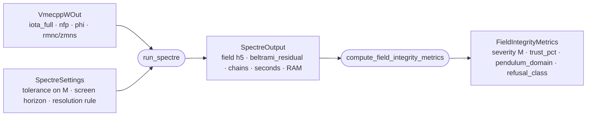

# SPECTRE field-integrity metrics

VMEC assumes nested flux surfaces, so its equilibrium cannot show the magnetic islands
its own boundary hosts. [SPECTRE](https://gitlab.com/spectre-eq/spectre) re-solves the
same boundary without that assumption and measures the **field integrity** of a design:
`M`, the severity of the lowest-order island chain, proportional to the flux it destroys.

The full description — every step of the algorithm walked on sixteen real designs, and what
running it on the whole dataset costs — is on the walkthrough page shared with the
maintainers. This file is the short version.

## The algorithm

1. **Screen.** Read the rotational transform `iota_full` and list every rational n/m the
   transform crosses, with n a multiple of the field periods and m ≤ `max_poloidal_order`
   (40). The lowest m is the chain to solve for; its unperturbed shear ι′ at the crossing
   is M's denominator. A design that crosses none is served `severity = 0`
   (`NO_RATIONAL`); a transform that passes through zero is served `None`
   (`SIGN_INDEFINITE`). No solve.
2. **Resolution.** `mpol = max(14, ⌈1.5 m⌉)`, `lrad = mpol + 4`, one volume, the magnetic
   axis pinned to VMEC's.
3. **Toroidal ladder.** Solve at `ntor = 14, 18, 22, 26` in turn, reading the field's
   Beltrami residual after each; stop at the first rung below `2τ` (τ = `tolerance_pct`,
   default 1 %), where M has converged to τ on the commissioning population. A residual
   above 5 that no longer falls with resolution is refused as `FIELD_DIVERGED`.
4. **Chain search.** One O-point and one X-point of the chain at ι = n/m, classified by
   the tangent map (Greene residues R_O, R_X); 1 800 s budget, one 8× retry when the
   chain is ill-conditioned. Nothing found → `SEARCH_INCOMPLETE`.
5. **Merge check** for transforms that cross n/m more than once: overlapping islands are
   one reconnected system (`NONTWIST_MERGED`, sum withheld); separated chains are summed.
6. **Pendulum domain.** `|R_O| ≤ 0.10` and `|R_X/R_O| ∈ [0.85, 1.15]`: where the flux
   relation `ΔΦ/Φ_edge = 0.825·M` was validated. Outside it M is still served and the
   predicted flux is flagged.
7. **The record**: `severity`, `trust_pct` (the most M could still move with higher
   resolution), residues, `pendulum_domain`, the resolution reached, seconds and RAM,
   `refusal_class`, `metrics_version`.

Definitions: `M = N_fp (R_O R_X)^{1/4} / (m² ι′)`;
`trust_pct = 0.41 + 100·C(residual)·residual` with C measured per residual band.

## What this pull request contains

`mhd/spectre_settings.py` and `mhd/spectre.py` with their tests. The screen, the ladder
controller and the reduction to metrics are pure Python and tested here; the two steps
that need a field (the solve and the fixed-point search) are the seams marked in
`run_spectre`, implemented in the commissioning repository and not yet wired in.

## You also need SPECTRE

SPECTRE is a Fortran code with a Python interface (scikit-build-core, CMake, a Fortran
compiler, HDF5; MIT licence). It has no PyPI release and one dependency pinned to a git
commit, so it cannot be a plain entry in `pyproject.toml` and cannot be built on this
repository's CI runners. Installing it: clone `gitlab.com/spectre-eq/spectre`, follow its
`compile_guides/`, `pip install -e .` in the same environment as `constellaration`.
`spectre` is imported lazily, inside `run_spectre` only, and every test here passes with
it absent.

## Open questions for the maintainers

1. **How should the solve run?** Every commissioning solve was a subprocess of SPECTRE's
   own `calc_spectre_field.py`, one core, one thread (the numbers on the walkthrough page
   are reproducible bit-for-bit that way). An in-process solve through SPECTRE's Python API
   is possible but has not been exercised. Which would you rather maintain?
2. **How should an optional backend that CI cannot build be declared?** A `spectre` extra
   pointing at the GitLab URL (`allow-direct-references` is already on), a documented
   manual install, or a separate package that `constellaration` imports when present?
3. **Which chain does a design get scored on when several coexist?** Lowest order
   (what ships), or the largest severity among the few lowest orders? On 4 of 11
   commissioning designs with two chains, the lower-order chain is the narrower one.
